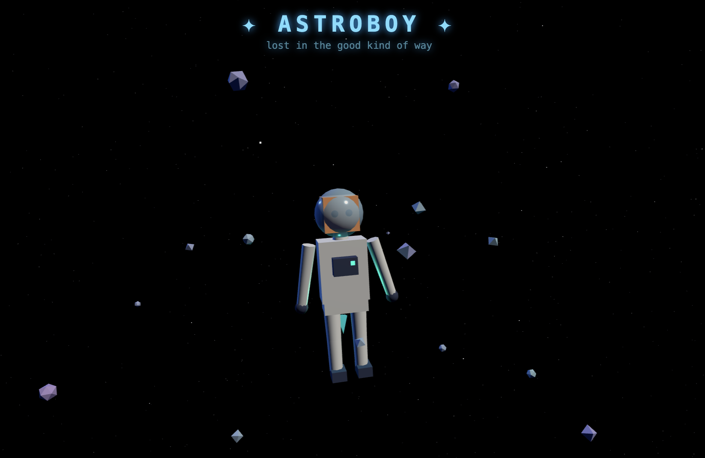

# AstroBoy 🚀

**[▶ Play it live](https://s3.amazonaws.com/sam.jasonacox.com-030769147843-us-east-1-an/demos/astroboy/index.html)**



A floating astronaut boy drifting through space — built with Three.js and served by a simple Python HTTP server.

Decode Caesar cipher transmissions to load AstroBoy's jetpack fuel. Solve all four to reach the stars. 🌟

## Run it locally

```bash
python3 app.py
```

Then open http://localhost:8080

## What you'll see

AstroBoy floats in zero gravity, thrusters glowing, surrounded by drifting debris. Intercepted cipher transmissions appear at the bottom — decode them to fuel his jetpack and travel to new worlds.

## Stack

- **Three.js** — 3D rendering in the browser
- **Python stdlib** — `http.server`, no dependencies

## Contributing

Found a bug or want to add a feature? Open an issue!
